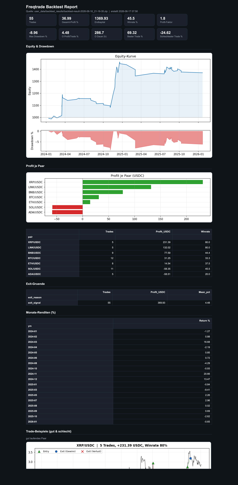

# freqtrade-report

Turn a Freqtrade backtest result into a clean, shareable **HTML report** — equity curve,
drawdown, per-pair P&L, exit-reason breakdown and monthly returns — in one command.

Freqtrade's built-in output is just text tables. This tool gives you a good-looking,
single-file report you can open in any browser or send to someone.


**The full report at a glance:**


**Entry/exit signals per pair (good & bad trades):**




> Or open the included [`example_report.html`](example_report.html) live in your browser.

## Install

```bash
pip install pandas numpy matplotlib
# freqtrade must be importable (run inside your freqtrade environment)
```

## Usage

```bash
python freqtrade_report.py path/to/backtest-result.zip -o report.html
```

- `source` — your Freqtrade backtest result file (`.zip` or `.json`, from `--export trades`)
- `-o, --output` — output HTML file (default: `freqtrade_report.html`)
- `--datadir` — Freqtrade data folder for the price charts (default: `user_data/data`)
- `--exchange` — exchange subfolder inside datadir (default: `binance`)
- `--timeframe` — candle timeframe for the charts (default: taken from the backtest)
- `--pairs` — how many good AND bad pairs to chart (default: `2`, i.e. 2 best + 2 worst)

**Where is the report saved?** In the folder you run the command from (your current
working directory). With `-o report.html` (no path) it lands right there — e.g. if you run
it from your `freqtrade` folder, the file is `freqtrade/report.html`. To save it somewhere
specific, give a full path, e.g. `-o ~/Desktop/report.html`.

Then just open the HTML file in your browser (double-click, or `open report.html` on macOS).
Everything (charts included) is embedded in the single file — nothing else to host.

An example output is included: [`example_report.html`](example_report.html).

## What's in the report

- **KPIs:** total profit %, end balance, win rate, profit factor, max drawdown, avg profit/trade, avg duration, best/worst trade
- **Equity curve + drawdown** chart
- **Profit per pair** (chart + table)
- **Exit-reason breakdown** (count, sum, mean %)
- **Monthly returns**
- **Trade examples:** price charts of the best- and worst-performing pairs with entry/exit
  markers (green ▲ entry, blue ● winning exit, red ✕ losing exit) — see at a glance where
  the strategy works and where it doesn't. (Needs the candle data in `--datadir`.)

## Requirements

Python 3.9+, `pandas`, `numpy`, `matplotlib`, and a working `freqtrade` install
(the tool uses `freqtrade.data.btanalysis` to read the result).

## Support / Donate

This tool is free. If it saves you time, a small tip is hugely appreciated 🙏

- ₿ **USDC (BEP20 / BSC network):** `0x5906b08f245d82f28f44192549bdbfb8370c948d`
  *(please send only on the BEP20/BSC network)*
- ☕ Buy Me a Coffee: *(coming soon)*

## License

MIT — see [LICENSE](LICENSE).
